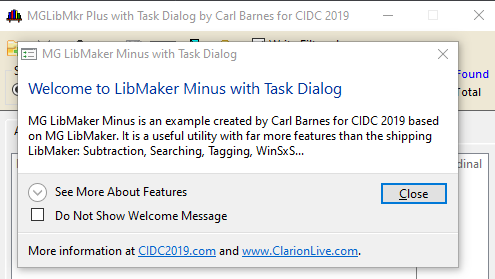
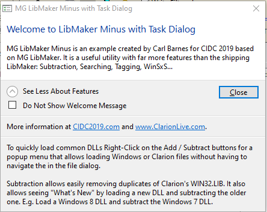
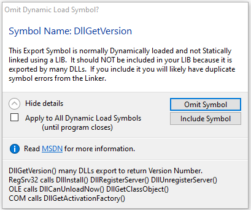
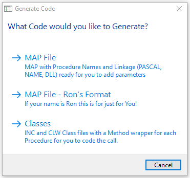
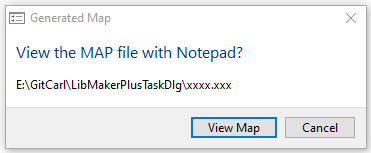

# LibMakerPlusTaskDlg
 LibMaker Plus has Message() replaced with the Vista Task Dialog. An example of Task Dialog for CIDC 2019. See the [LibMakerPlus Repo](https://github.com/CarlTBarnes/LibMakerPlus) ReadMe for information on the features in this LibMaker.

 Below are some screen captures from the program. The Task Dialog offers many more features than Messgae(). The full Task Dialog presentation is available on the CIDC 2019 website.



The See More button collapses verbose text.



This Task Dlg shows a Footer with an Icon and Link to MSDN. The expanded details can optionally show below the footer.



Buttons may be "Command Links" that have larger font first line then smaller font with more. 



A Task Dlg has a "Main Instruction" first line in a Larger Blue font.



The example includes my CBTaskDlgClass class that wraps the complexity of the TaskDialog. It is much more complex than a Message(). It would probably be best to wait for Unicode

```Clarion
TskDlg_GenerateCode PROCEDURE()!,BYTE  !Task Dialog asks what code to Generate 1=Map 2=Ron 3=Class
TD  CBTaskDlgClass
Ret123  BYTE   
    CODE
    !return MESSAGE('What Code would you like to generate?','Generate Code', SYSTEM{PROP:Icon},|
    !             '&Map|Map (&Rons)|&Classes|Cl&ose')  

    TD.Init()
    TD.DD.Instruction='What Code would you like to Generate?'
    TD.DD.Caption    ='Generate Code'
    TD.DD.Flag.ButtonCmdLinks=1   !Command Links are Buttons witjh a Large Font Line 1, then the rest is smaller
    TD.BtnCustomAdd(11, 'MAP File<13,10>MAP with Procedure Names and Linkage (PASCAL, NAME, DLL) ready for you to add parameters',1)   !Default radio
    TD.BtnCustomAdd(12, 'MAP File - Ron''s Format<13,10>If your name is Ron this is for just for You!')
    TD.BtnCustomAdd(13, 'Classes<13,10>INC and CLW Class files with a Method wrapper for each Procedure for you to code the call.')
    TD.Btns_OYNRCL('C','C')      !Cancel and it is the Default
    TD.DD.Flag.CancelAllowed=1  !Red X in Corner
    TD.DD.Width=180  !180 DLUs looks good, default is too wide
    TD.Show()
    Ret123=TD.result.ButtonID
    CASE Ret123
    OF 11 TO 13 ; Ret123 -= 10
    ELSE        ; Ret123 = 0
    END
    RETURN Ret123
```

```Clarion
TD  CBTaskDlgClass
Ret12 BYTE
    CODE
    TD.Init()
    TD.dd.Caption='Omit Dynamic Load Symbol?'
    TD.dd.Instruction='Symbol Name: ' & SymName
    TD.dd.Content='This Export Symbol is normally Dynamically loaded and not Statically linked using a LIB.' & |
                '  It should NOT be included in your LIB because it is exported by many DLLs.'&|
                '  If you include it you will likely have duplicate symbol errors from the Linker.'
    TD.BtnCustomAdd(101,'&Omit Symbol')
    TD.BtnCustomAdd(102,'&Include Symbol')
    TD.DD.CheckboxLabel='&Apply to All Dynamic Load Symbols<13,10> {9}(until program closes)'
    TD.DD.ExpandedText=|  ! 'See MSDN for more information:<13,10>' & |
            'DllGetVersion() many DLLs export to return Version Number.' & |
            '<13,10>RegSrv32 calls DllInstall() DllRegisterServer() DllUnregisterServer()' & |
            '<13,10>OLE calls DllCanUnloadNow() DllGetClassObject()' & |
            '<13,10>COM calls DllGetActivationFactory()'
    TD.dd.flag.ExpandInFooter=1            
    TD.dd.FooterText='Read ' & td.HRefText('https://msdn.microsoft.com','MSDN') & ' for more information.'
    Td.dd.IconFooter=TD_ICON_INFORMATION
    TD.DD.Width=200
    TD.DD.Flag.Position2Window=1    !this does not seem to do anything, would
    TD.Show()
    Ret12=TD.Result.ButtonID-100
    IF TD.Result.Checked THEN OmtIncAllDllX=Ret12 .
    return Ret12

```
